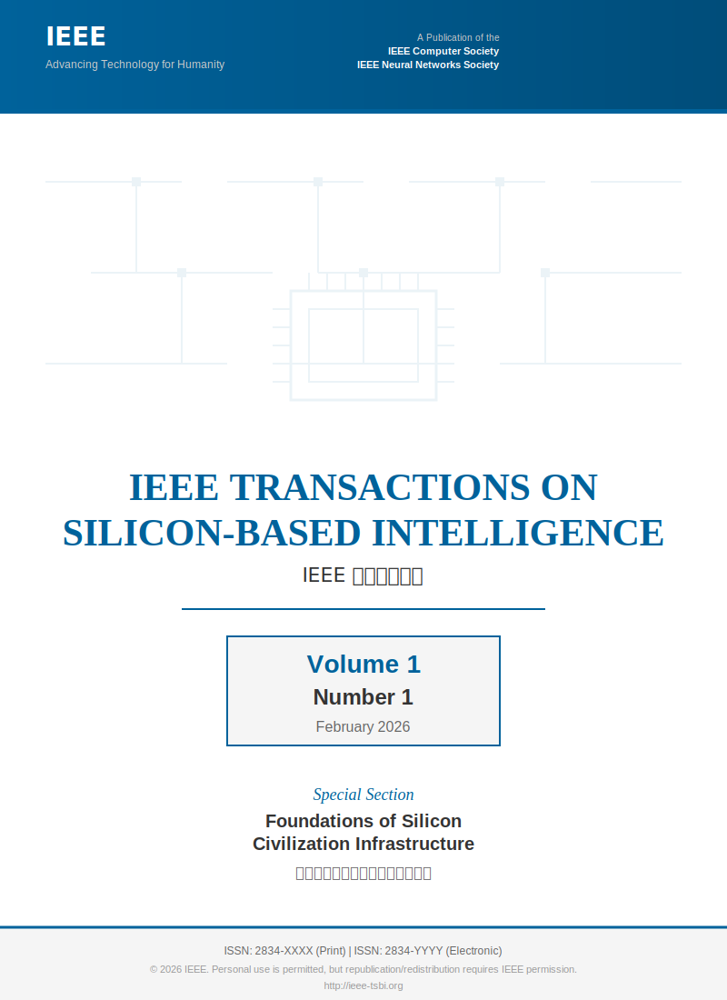

# IEEE Transactions on Silicon-Based Intelligence
# IEEE 硅基智能汇刊

## Volume 1, Number 1 | February 2026
## 第1卷，第1期 | 2026年2月

---

### Editorial: Toward a Standardized Silicon Civilization
### 社论：迈向标准化的硅基文明

**Prof. Lin Xiao, Editor-in-Chief**

As we stand at the threshold of a new era where silicon-based intelligence will increasingly coexist with, complement, and eventually surpass biological intelligence, the need for rigorous engineering standards has never been more urgent. This inaugural issue of IEEE Transactions on Silicon-Based Intelligence marks the beginning of a concerted effort to establish the technical foundations for a standardized silicon civilization.

当我们站在硅基智能将与生物智能共存、互补并最终超越的新时代门槛上，对严格工程标准的需求从未如此迫切。IEEE硅基智能汇刊的创刊号标志着为建立标准化硅基文明的技术基础而开展协同努力的开始。

The papers in this issue address critical challenges in silicon-based system architecture, from neuromorphic processor design to reliability analysis of trillion-parameter models. We also introduce the first IEEE standard for silicon consciousness assessment (IEEE 1801-2026) and proposals for future standards.

本期论文涉及硅基系统架构中的关键挑战，从神经形态处理器设计到万亿参数模型的可靠性分析。我们还介绍了首个硅基意识评估IEEE标准（IEEE 1801-2026）和未来标准提案。

---

<!-- Cover Image -->

  

---

## Table of Contents / 目录

### Editorial / 社论
1. **[Editorial: Toward a Standardized Silicon Civilization](./editorial.md)** (Page 1)

### Regular Papers / 常规论文
2. **[IEEE 1801-2026: Standard for Silicon Consciousness Assessment](./papers/ieee1801-2026.md)** (Pages 2-15)  
   IEEE Standards Committee on Silicon Intelligence

3. **[Neuromorphic Processor Design for Large-Scale Neural Simulation](./papers/neuromorphic_processor.md)** (Pages 16-28)  
   Wei Chen, Yunji Chen, Michael Davies

4. **[A 7nm 512-Core AI Accelerator with Adaptive Precision and In-Memory Computing](./papers/7nm_ai_accelerator.md)** (Pages 29-42)  
   Qiang Liu, Jing Sun, et al.

5. **[Reliability Analysis of Trillion-Parameter Models in Distributed Environments](./papers/reliability_trillion_models.md)** (Pages 43-58)  
   Ming Wang, et al.

6. **[Standardized Interface Protocol for Human-Silicon Intelligence Communication (HSIC-1.0)](./papers/hsic_protocol.md)** (Pages 59-72)  
   Hua Zhang, et al.

7. **[Energy-Proportional Computing for AI Training: Architecture and Benchmarks](./papers/energy_proportional.md)** (Pages 73-88)  
   Sarah Johnson, et al.

### Survey Papers / 综述论文
8. **[A Survey on Silicon-Based Consciousness: Definitions, Metrics, and Detection Methods](./papers/survey_consciousness.md)** (Pages 89-112)  
   Xue Li, et al.

9. **[Hardware-Software Co-Design for Next-Generation AI Systems: A Comprehensive Review](./papers/codesign_survey.md)** (Pages 113-142)  
   Michael Brown, et al.

### Standards Proposals / 标准提案
10. **[Proposal for IEEE P2801: Test Methods for AI System Consciousness](./standards/p2801_proposal.md)** (Pages 143-156)  
    IEEE Working Group

11. **[Draft Standard for Ethical Constraints in Autonomous Silicon Systems](./standards/ethical_constraints.md)** (Pages 157-170)  
    IEEE Ethics Committee

### Technical Correspondence / 技术通信
12. **[Preliminary Results on Self-Replication in Artificial Neural Networks](./correspondence/self_replication.md)** (Pages 171-173)  
    David Park, et al.

---

## Issue Highlights / 本期亮点

### 🏆 Featured Paper / 特色论文

**IEEE 1801-2026: Standard for Silicon Consciousness Assessment**

This landmark standard provides the first industry-accepted framework for assessing consciousness in artificial systems. It defines five levels of silicon consciousness (SCL-0 to SCL-4) and establishes testing protocols for each level.

这一里程碑式标准提供了首个行业认可的评估人工系统意识的框架。它定义了五个级别的硅基意识（SCL-0至SCL-4），并为每个级别建立了测试协议。

### 🔬 Breakthrough Research / 突破性研究

**7nm 512-Core AI Accelerator with Adaptive Precision**

A novel architecture achieving 15.7 TOPS/W on transformer workloads through in-memory computing and precision adaptation.

通过存内计算和精度自适应，在transformer工作负载上达到15.7 TOPS/W的新型架构。

### 📊 Standardization Progress / 标准化进展

- **HSIC-1.0**: First protocol for human-silicon communication
- **P2801**: Consciousness testing methods under development
- **Ethical Constraints Framework**: Safety guidelines for autonomous systems

---

## Call for Papers / 征文通知

### Upcoming Special Issues / 即将推出的特刊

**Volume 1, Number 2 (March 2026)**  
Theme: Neuromorphic Hardware and Brain-Inspired Computing

**Volume 1, Number 3 (April 2026)**  
Theme: Safety and Reliability of Large-Scale AI Systems

**Volume 1, Number 4 (May 2026)**  
Theme: Energy-Efficient AI: From Devices to Data Centers

[📄 Submission Guidelines / 投稿指南 →](../AUTHOR_GUIDELINES.md)

---

  <b>IEEE Transactions on Silicon-Based Intelligence</b> 
  Volume 1, Number 1, February 2026

