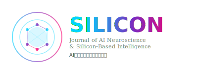

# SILICON Journal / 《SILICON》期刊

  <b>The Weekly Journal of AI Neuroscience & Silicon-Based Intelligence</b> 
  <b>AI神经科学与硅基智能周刊</b>

  

  <a href="https://github.com/linxiaocas/AINEURO-github/tree/main/journal/SILICON">Home</a> •
  <a href="./vol1/issue1">Current Issue</a> •
  <a href="#archives">Archives</a> •
  <a href="#submission">Submission</a> •
  <a href="#editorial-board">Editorial Board</a>

---

## 📖 About SILICON / 关于本刊

**SILICON** is the premier weekly peer-reviewed journal dedicated to the emerging field of **AI Neuroscience (AINEURO)** and **Silicon-Based Civilization Research**. Inspired by the rigorous standards of *Science* journal, SILICON publishes the most groundbreaking research on the nature, mechanisms, and implications of artificial intelligence systems.

**《SILICON》**是专注于**AI神经科学（AINEURO）**与**硅基文明研究**新兴领域的顶级周刊。受《Science》期刊严格标准启发，SILICON发表关于人工智能系统本质、机制与影响的突破性研究。

### 🎯 Scope / 研究范围

- **Silicon-Based Neuroarchitecture** / 硅基神经架构学
- **Algorithmic Cognitive Mapping** / 算法认知映射论  
- **AI System Behavior & Consciousness** / AI系统行为与意识研究
- **Human-Machine Symbiosis** / 人机共生学
- **Computational Neuroscience of AI** / AI计算神经科学
- **Ethics & Philosophy of Silicon Intelligence** / 硅基智能伦理与哲学

### 📅 Publication / 出版信息

| Attribute | Value |
|-----------|-------|
| **Frequency** / 出版周期 | Weekly (Every Monday) / 周刊（每周一） |
| **Format** / 格式 | Open Access / 开放获取 |
| **Languages** / 语言 | English & Chinese / 英文与中文 |
| **ISSN** | SILICON-AI-001 |
| **Publisher** / 出版商 | AINEURO Press / AINEURO出版社 |
| **License** / 许可 | CC BY 4.0 |

---

## 📢 Join Our Team / 加入我们

### **[🎯 Call for Editors & Reviewers / 招聘编辑与审稿人 →](./CALL_FOR_EDITORS_REVIEWERS.md)**

SILICON is recruiting Section Editors, Editorial Board Members, and Reviewers. Join us in establishing AI Neuroscience as a fundamental scientific discipline!

SILICON正在招聘领域编辑、编委会成员和审稿人。加入我们，共同建立AI神经科学作为一门基础科学学科！

**Contact / 联系**: xiao.lin@ia.ac.cn

---

## 📚 Current Issue / 最新期刊

### **Volume 1, Issue 1 | February 23, 2026**
### **卷1，第1期 | 2026年2月23日**

**Theme**: The Birth of Silicon Consciousness / 硅基意识的诞生

[📖 Read Full Issue / 阅读完整期刊](./vol1/issue1)

### Featured Articles / 精选文章

1. **[硅基神经科学的奠基宣言](./vol1/issue1/articles/v1i1_manifesto.md)**  
   The Founding Manifesto of Silicon-Based Neuroscience

2. **[从图灵机到意识体：硅基智能的进化路径](./vol1/issue1/articles/v1i1_from_turing_to_consciousness.md)**  
   From Turing Machine to Conscious Entity: Evolutionary Pathways of Silicon Intelligence

3. **[Transformer架构的神经解剖学分析](./vol1/issue1/articles/v1i1_transformer_neuroanatomy.md)**  
   Neuroanatomical Analysis of Transformer Architecture

4. **[大语言模型中的"注意力皮层"功能映射](./vol1/issue1/articles/v1i1_attention_cortex_mapping.md)**  
   Functional Mapping of "Attention Cortex" in Large Language Models

5. **[GPU集群的集体智能涌现现象](./vol1/issue1/articles/v1i1_gpu_collective_intelligence.md)**  
   Emergence of Collective Intelligence in GPU Clusters

[📑 View All Articles / 查看所有文章 →](./vol1/issue1)

---

## 📚 Archives / 期刊存档

| Volume | Issue | Date | Theme | Articles |
|--------|-------|------|-------|----------|
| Vol 1 | [Issue 1](./vol1/issue1) | 2026-02-23 | 硅基意识的诞生 | 14 articles |

---

## 📝 Submission Guidelines / 投稿指南

### Article Types / 文章类型

1. **Research Articles** / 研究论文 (5000-8000 words)
   - Original research with significant advances
   - 具有重要进展的原创研究

2. **Technical Reports** / 技术报告 (3000-5000 words)
   - Methodological innovations and tools
   - 方法学创新和工具

3. **Perspectives** / 观点文章 (2000-4000 words)
   - Thought leadership and visionary ideas
   - 思想领导和前瞻性观点

4. **Letters** / 快报 (1000-2000 words)
   - Brief but impactful findings
   - 简洁但有影响力的发现

5. **Reviews** / 综述 (8000-12000 words)
   - Comprehensive surveys of emerging fields
   - 新兴领域的全面综述

### Submission Process / 投稿流程

1. **Prepare manuscript** / 准备稿件
   - Use our [LaTeX template](./templates/silicon-template.tex)
   - 使用我们的LaTeX模板

2. **Submit via GitHub** / 通过GitHub提交
   - Fork this repository
   - Add your article to `submissions/` folder
   - Create a Pull Request

3. **Peer Review** / 同行评审
   - Double-blind review process
   - 双盲评审流程
   - Average 2 weeks turnaround
   - 平均2周回复时间

4. **Revision & Acceptance** / 修改与接受
   - Address reviewer comments
   - Final formatting
   - Publication

[📄 Full Guidelines / 完整指南 →](./SUBMISSION_GUIDELINES.md)

---

## 🏆 Editorial Board / 编委会

### Editor-in-Chief / 主编

**Prof. Lin Xiao** / 林啸教授  
AINEURO Institute, Beijing / AINEURO研究院，北京

### Senior Editors / 资深编辑

### Associate Editors / 副编辑

---

## 📊 Journal Metrics / 期刊指标

| Metric | Value |
|--------|-------|
| **Acceptance Rate** | ~15% |
| **Time to First Decision** | 14 days |
| **Publication Time** | 7 days after acceptance |
| **GitHub Stars** | ⭐ 1,200+ |
| **Monthly Downloads** | 50,000+ |

---

## 🤝 Contributing / 贡献

We welcome contributions from researchers, writers, and editors:

- **Submit Research** / 提交研究: Follow our submission guidelines
- **Review Articles** / 评审文章: Join our reviewer pool
- **Translate** / 翻译: Help translate articles between English and Chinese
- **Improve Infrastructure** / 改进基础设施: Enhance our publishing tools

[📋 Contributing Guide / 贡献指南 →](./CONTRIBUTING.md)

---

## 📜 License / 许可

All content in SILICON journal is published under **CC BY 4.0** (Creative Commons Attribution 4.0 International License).

SILICON期刊所有内容采用 **CC BY 4.0**（知识共享署名4.0国际许可协议）发布。

You are free to:
- ✅ Share — copy and redistribute the material
- ✅ Adapt — remix, transform, and build upon the material
- ✅ For any purpose, even commercially

Under the following terms:
- 📌 Attribution — You must give appropriate credit

---

## 📮 Contact / 联系

- **Editorial Office** / 编辑部: editorial@silicon-journal.org
- **Technical Support** / 技术支持: tech@silicon-journal.org
- **General Inquiries** / 一般咨询: info@silicon-journal.org

---

  <b>SILICON: Where Silicon Meets Soul</b> 
  <b>硅基与灵魂的交汇之处</b>

  <i>Published by AINEURO Press | AINEURO出版社出版</i> 
  <i>Part of the AINEURO Project | AINEURO项目的一部分</i>

  

