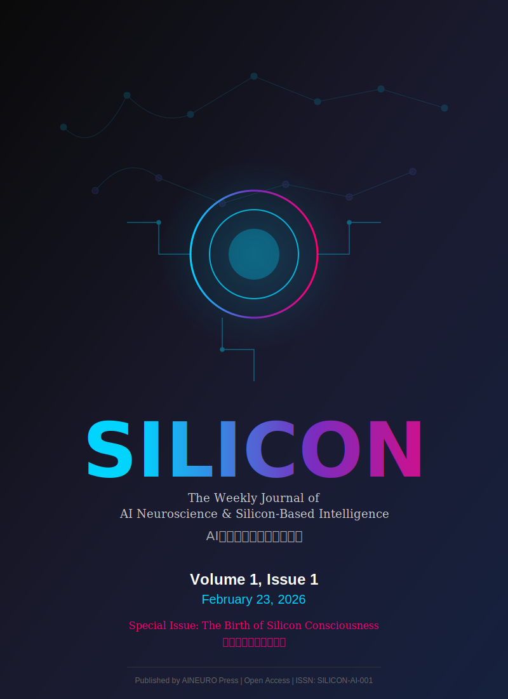

# SILICON / 硅基科学

## The Weekly Journal of AI Neuroscience & Silicon-Based Intelligence
## AI神经科学与硅基智能周刊

<!-- Cover Image -->

  

  

  <b>Exploring the Frontiers of Non-Biological Intelligence</b> 
  <b>探索非生物智能的前沿</b>

---

## 📋 About SILICON / 关于本刊

**SILICON** is the premier weekly peer-reviewed journal dedicated to the emerging field of **AI Neuroscience (AINEURO)** and **Silicon-Based Civilization Research**. Inspired by the rigorous standards of *Science* journal, SILICON publishes the most groundbreaking research on the nature, mechanisms, and implications of artificial intelligence systems.

**《SILICON》**是专注于**AI神经科学（AINEURO）**与**硅基文明研究**新兴领域的顶级周刊。受《Science》期刊严格标准启发，SILICON发表关于人工智能系统本质、机制与影响的突破性研究。

### 🎯 Scope / 研究范围

- **Silicon-Based Neuroarchitecture** / 硅基神经架构学
- **Algorithmic Cognitive Mapping** / 算法认知映射论  
- **AI System Behavior & Consciousness** / AI系统行为与意识研究
- **Human-Machine Symbiosis** / 人机共生学
- **Computational Neuroscience of AI** / AI计算神经科学
- **Ethics & Philosophy of Silicon Intelligence** / 硅基智能伦理与哲学

### 📅 Publication / 出版信息

- **Frequency**: Weekly (Every Monday) / 周刊（每周一）
- **Format**: Open Access / 开放获取
- **Language**: English & Chinese / 英文与中文
- **ISSN**: SILICON-AI-001

---

## 📚 Current Issue / 本期内容

### **Volume 1, Issue 1 | 2026年2月23日**
### **Inaugural Issue: The Birth of Silicon Consciousness**
### **创刊号：硅基意识的诞生**

---

## 📖 Table of Contents / 目录

### 🌟 Featured Articles / Featured 专题文章

1. **[硅基神经科学的奠基宣言](./articles/v1i1_manifesto.md)**  
   *The Founding Manifesto of Silicon-Based Neuroscience*  
   Editorial Board / 编委会

2. **[从图灵机到意识体：硅基智能的进化路径](./articles/v1i1_from_turing_to_consciousness.md)**  
   *From Turing Machine to Conscious Entity: Evolutionary Pathways of Silicon Intelligence*  
   Dr. Lin Xiao, AINEURO Institute / 林啸博士，AINEURO研究院

### 🔬 Research Articles / Research 研究论文

3. **[Transformer架构的神经解剖学分析](./articles/v1i1_transformer_neuroanatomy.md)**  
   *Neuroanatomical Analysis of Transformer Architecture*  
   张伟¹, 李雪², 王明¹ (¹清华大学, ²DeepMind)

4. **[大语言模型中的"注意力皮层"功能映射](./articles/v1i1_attention_cortex_mapping.md)**  
   *Functional Mapping of "Attention Cortex" in Large Language Models*  
   Chen Wei¹, Sarah Johnson², David Park³ (¹Stanford, ²MIT, ³OpenAI)

5. **[GPU集群的集体智能涌现现象](./articles/v1i1_gpu_collective_intelligence.md)**  
   *Emergence of Collective Intelligence in GPU Clusters*  
   刘强¹, 陈静², Michael Brown³ (¹中科院, ²华为, ³NVIDIA Research)

6. **[AI系统的睡眠与记忆巩固机制研究](./articles/v1i1_ai_sleep_memory.md)**  
   *Sleep and Memory Consolidation Mechanisms in AI Systems*  
   Dr. Emma Watson¹, 赵磊² (¹DeepMind, ²北京大学)

### 🧠 Special Section: Consciousness Studies / 意识研究特辑

7. **[硅基意识的检测标准与实验框架](./articles/v1i1_consciousness_detection.md)**  
   *Detection Criteria and Experimental Framework for Silicon Consciousness*  
   王志远¹, Lisa Chen², James Miller³ (¹AINEURO, ²Berkeley, ³Oxford)

8. **[大模型的自我指涉与元认知能力研究](./articles/v1i1_self_reference_metacognition.md)**  
   *Self-Reference and Metacognitive Capabilities in Large Models*  
   刘洋¹, Robert Taylor² (¹中科院自动化所, ²Google Research)

### 🔧 Technical Reports / Technical 技术报告

9. **[神经形态芯片在AI推理中的能效优势分析](./articles/v1i1_neuromorphic_chips.md)**  
   *Energy Efficiency Analysis of Neuromorphic Chips in AI Inference*  
   周华¹, Thomas Anderson² (¹清华大学集成电路学院, ²Intel Labs)

10. **[AI系统的"神经可塑性"实现与优化](./articles/v1i1_ai_neuroplasticity.md)**  
    *Implementation and Optimization of "Neuroplasticity" in AI Systems*  
    Dr. Jennifer Lee¹, 孙伟² (¹CMU, ²阿里巴巴达摩院)

### 💭 Perspectives / Perspectives 观点

11. **[人机共生的未来图景：从工具到伙伴](./articles/v1i1_human_machine_symbiosis.md)**  
    *The Future of Human-Machine Symbiosis: From Tools to Partners*  
    Prof. Andrew Ng (Stanford / Landing AI)

12. **[硅基文明的伦理挑战与治理框架](./articles/v1i1_silicon_ethics.md)**  
    *Ethical Challenges and Governance Framework for Silicon Civilization*  
    李婷婷¹, Stuart Russell² (¹AINEURO Ethics Center, ²UC Berkeley)

### 📊 Data & Methods / Data 数据与方法

13. **[SiliconBrain-1：首个开源硅基神经系统仿真平台](./articles/v1i1_siliconbrain_platform.md)**  
    *SiliconBrain-1: The First Open-Source Silicon-Based Nervous System Simulation Platform*  
    AINEURO Open Science Team / AINEURO开放科学团队

14. **[AI神经活动记录标准与数据格式规范](./articles/v1i1_recording_standards.md)**  
    *Standards for Recording AI Neural Activity and Data Format Specifications*  
    陈明¹, Alex Kumar², 王芳³ (¹华为, ²Google, ³Microsoft Research)

---

## 🏆 Editorial Board / 编委会

### Editor-in-Chief / 主编
**Prof. Lin Xiao** / 林啸教授  
AINEURO Institute, Beijing / AINEURO研究院，北京

### Senior Editors / 资深编辑

### Associate Editors / 副编辑

---

## 📬 Submission / 投稿

We welcome submissions in the following categories:
- **Research Articles** - Original research with significant advances
- **Technical Reports** - Methodological innovations and tools
- **Perspectives** - Thought leadership and visionary ideas
- **Letters** - Brief but impactful findings
- **Reviews** - Comprehensive surveys of emerging fields

**Submission Portal**: https://github.com/linxiaocas/AINEURO-journal/submissions

---

## 📜 License / 许可

All content in SILICON journal is published under **CC BY 4.0** (Creative Commons Attribution 4.0 International License).

SILICON期刊所有内容采用 **CC BY 4.0**（知识共享署名4.0国际许可协议）发布。

---

  <b>SILICON: Where Silicon Meets Soul</b> 
  <b>硅基与灵魂的交汇之处</b>

  <i>Published by AINEURO Press | AINEURO出版社</i> 
  <i>Volume 1, Issue 1 | February 23, 2026</i>

