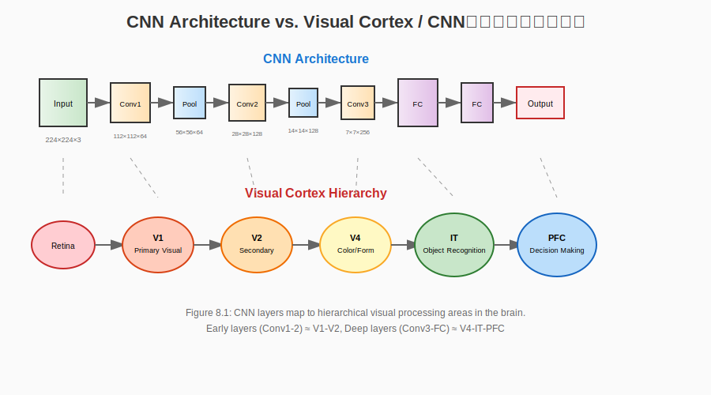

# Chapter 8: Deep Learning and Neural Circuits / 深度学习与神经环路

## Chapter Objectives / 本章目标

By the end of this chapter, you will be able to:
- Map CNN architectures to the visual cortex hierarchy
- Understand RNNs as models of sequential neural processing
- Explain Transformer attention through the lens of working memory
- Compare biological and artificial neural network principles
- Design biologically-informed deep learning architectures

在本章结束时，你将能够：
- 将CNN架构映射到视觉皮层层次
- 理解RNN作为序列神经处理的模型
- 通过工作记忆的视角解释Transformer注意力
- 比较生物和人工神经网络原理
- 设计生物启发的深度学习架构

---

## 8.1 Convolutional Neural Networks and the Visual Cortex / 卷积神经网络与视觉皮层

### 8.1.1 The Visual Pathway Hierarchy / 视觉通路层次



*Figure 8.1: CNN layers map to hierarchical visual processing areas in the brain.*

```
┌─────────────────────────────────────────────────────────────────────────────┐
│                    VISUAL PROCESSING HIERARCHY / 视觉处理层次                │
├─────────────────────────────────────────────────────────────────────────────┤
│                                                                             │
│  BIOLOGICAL PATHWAY / 生物通路          CNN ARCHITECTURE / CNN架构          │
│  ═══════════════════════════════════    ═══════════════════════════         │
│                                                                             │
│  RETINA / 视网膜                      INPUT LAYER / 输入层                  │
│  ┌─────────────┐                      ┌─────────────────────────┐          │
│  │ Photorecept.│  Light → Voltage    │ 224×224×3 RGB Image    │          │
│  │ 光感受器     │  光→电压            │ 224×224×3 RGB图像       │          │
│  └──────┬──────┘                      └───────────┬───────────┘          │
│         │                                         │                       │
│         ▼                                         ▼                       │
│  LGN / 外侧膝状体                   CONV1 / 卷积层1                         │
│  ┌─────────────┐                      ┌─────────────────────────┐          │
│  │ Relay cells │  Center-surround     │ 64 filters, 7×7        │          │
│  │ 中继细胞     │  中心- surround      │ 64个滤波器，7×7        │          │
│  │             │  (spot detection)    │ (edge detection)       │          │
│  │             │  (点检测)             │ (边缘检测)              │          │
│  └──────┬──────┘                      └───────────┬───────────┘          │
│         │                                         │                       │
│         ▼                                         ▼                       │
│  V1 / 初级视觉皮层                  CONV2-3 / 卷积层2-3                      │
│  ┌─────────────┐                      ┌─────────────────────────┐          │
│  │ Simple cells│  Oriented edges      │ 128-256 filters        │          │
│  │ 简单细胞     │  定向边缘            │ 3×3, 5×5               │          │
│  │ (Hubel&Wiesel│                     │ textures, patterns     │          │
│  │  1962)      │  ─────────────────►  │ 纹理、模式              │          │
│  ├─────────────┤                      ├─────────────────────────┤          │
│  │ Complex cells│ Integration,        │ Pooling layers         │          │
│  │ 复杂细胞     │  position invariance │ 池化层                 │          │
│  └──────┬──────┘                      └───────────┬───────────┘          │
│         │                                         │                       │
│         ▼                                         ▼                       │
│  V2-V4 / 视觉区2-4                  CONV4-5 / 卷积层4-5                      │
│  ┌─────────────┐                      ┌─────────────────────────┐          │
│  │ Contours    │  Curvature,          │ 512 filters            │          │
│  │ 轮廓        │  textures            │ object parts           │          │
│  │ Textures    │  曲率、纹理          │ 物体部件                │          │
│  │ 纹理        │  ─────────────────►  │                        │          │
│  └──────┬──────┘                      └───────────┬───────────┘          │
│         │                                         │                       │
│         ▼                                         ▼                       │
│  IT / 颞下皮层                      FC / 全连接层                             │
│  ┌─────────────┐                      ┌─────────────────────────┐          │
│  │ Object      │  View-invariant      │ 4096-4096-1000         │          │
│  │ 物体        │  object rep.         │ neurons                │          │
│  │ Face cells  │  视角不变物体表征    │ 神经元                  │          │
│  │ 面孔细胞     │  ─────────────────►  │ category detection     │          │
│  │ (Gross 1972)│                     │ 类别检测                │          │
│  └──────┬──────┘                      └───────────┬───────────┘          │
│         │                                         │                       │
│         ▼                                         ▼                       │
│  DECISION / 决策                    OUTPUT / 输出                             │
│  ┌─────────────┐                      ┌─────────────────────────┐          │
│  │ PFC,        │  Recognition,        │ Softmax probabilities  │          │
│  │  前额叶      │  action selection    │ 1000 classes           │          │
│  │ Basal gang. │  识别、动作选择      │ Softmax概率            │          │
│  │ 基底神经节   │                     │ 1000类                 │          │
│  └─────────────┘                      └─────────────────────────┘          │
│                                                                             │
└─────────────────────────────────────────────────────────────────────────────┘
```

### 8.1.2 Receptive Fields: Biological and Artificial / 感受野：生物与人工

```
┌─────────────────────────────────────────────────────────────────────────────┐
│           RECEPTIVE FIELD PROGRESSION / 感受野进展                          │
├─────────────────────────────────────────────────────────────────────────────┤
│                                                                             │
│  HIERARCHICAL INCREASE IN RECEPTIVE FIELD SIZE / 感受野大小层次增加          │
│                                                                             │
│  Layer    Biological RF      Artificial Kernel      Ratio / 比例            │
│  ─────────────────────────────────────────────────────────────────────────  │
│                                                                             │
│  V1       1-2°               7×7 (1°)              1:1                     │
│           (视网膜角度)        (像素)                                         │
│                                                                             │
│  V2       2-4°               3×3 pool              2:1                     │
│                                                                             │
│  V4       4-8°               3×3 conv, d=2         4:1                     │
│                              (dilated/atrous)                                │
│                              (空洞卷积)                                       │
│                                                                             │
│  IT       10-20°             Global pool           10:1                    │
│                              (全图)                                          │
│                                                                             │
│  VISUALIZATION / 可视化:                                                    │
│                                                                             │
│  Input Image: 224×224 pixels / 像素                                         │
│  ┌─────────────────────────────────────────────────────────────────────┐   │
│  │                                                                     │   │
│  │   [===] V1 RF: 7×7     (local edge) / 局部边缘                     │   │
│  │                                                                     │   │
│  │   [==========] V4 RF:  28×28  (texture) / 纹理                     │   │
│  │                                                                     │   │
│  │   [===============================] IT RF: 224×224 (object) / 物体  │   │
│  │                                                                     │   │
│  └─────────────────────────────────────────────────────────────────────┘   │
│                                                                             │
│  KEY PRINCIPLE / 关键原理:                                                  │
│  Increasing receptive fields enable hierarchical feature composition       │
│  感受野增加使层次特征组合成为可能                                           │
│                                                                             │
└─────────────────────────────────────────────────────────────────────────────┘
```

### 8.1.3 Feature Complexity Progression / 特征复杂度进展

```python
"""
Feature Hierarchy in CNNs and Visual Cortex / CNN和视觉皮层中的特征层次
Demonstrates how complexity increases through layers
演示复杂度如何通过层次增加
"""

import numpy as np

class FeatureHierarchy:
    """
    Model of hierarchical feature extraction
    层次特征提取模型
    """
    
    def __init__(self):
        self.layers = {
            'V1': {
                'features': ['horizontal_edge', 'vertical_edge', '45°_edge', '135°_edge'],
                '特征': ['水平边缘', '垂直边缘', '45°边缘', '135°边缘'],
                'complexity': 1,
                'receptive_field': '7×7',
                'invariance': 'none'
            },
            'V2': {
                'features': ['contour_segment', 'corner', 'texture_element'],
                '特征': ['轮廓段', '角点', '纹理元素'],
                'complexity': 2,
                'receptive_field': '14×14',
                'invariance': 'position'
            },
            'V4': {
                'features': ['curved_contour', 'texture_pattern', 'simple_shape'],
                '特征': ['曲线轮廓', '纹理模式', '简单形状'],
                'complexity': 3,
                'receptive_field': '28×28',
                'invariance': 'position, scale'
            },
            'IT': {
                'features': ['object_part', 'face_feature', 'complete_object'],
                '特征': ['物体部件', '面部特征', '完整物体'],
                'complexity': 4,
                'receptive_field': '224×224',
                'invariance': 'position, scale, viewpoint'
            }
        }
    
    def analyze(self, layer_name):
        """Analyze features at specific layer / 分析特定层的特征"""
        layer = self.layers[layer_name]
        
        print(f"\n{'='*60}")
        print(f"Layer / 层: {layer_name}")
        print(f"{'='*60}")
        print(f"Feature Complexity Level / 特征复杂度级别: {layer['complexity']}/4")
        print(f"Receptive Field Size / 感受野大小: {layer['receptive_field']}")
        print(f"Invariance Properties / 不变性属性: {layer['invariance']}")
        print(f"\nDetected Features / 检测特征:")
        for feat_en, feat_cn in zip(layer['features'], layer['特征']):
            print(f"  • {feat_en} / {feat_cn}")
    
    def compare_cnn_neuroscience(self):
        """Compare CNN and neuroscience features / 比较CNN和神经科学特征"""
        print(f"\n{'='*60}")
        print("CNN vs. Neuroscience Mapping / CNN vs. 神经科学映射")
        print(f"{'='*60}")
        
        comparisons = [
            ("Conv Layer 1", "V1 Simple Cells", "Gabor-like edge detection"),
            ("Conv Layer 2", "V1 Complex Cells", "Orientation pooling"),
            ("Conv Layer 3", "V2", "Texture and contour integration"),
            ("Conv Layer 4-5", "V4", "Shape and pattern recognition"),
            ("FC Layers", "IT Cortex", "Object-selective responses"),
            ("Classifier", "PFC", "Category decision and action"),
        ]
        
        for cnn, bio, function in comparisons:
            print(f"\n{cnn:15} ↔ {bio:20}")
            print(f"  Function / 功能: {function}")

# Demonstration / 演示
if __name__ == "__main__":
    hierarchy = FeatureHierarchy()
    
    for layer in ['V1', 'V2', 'V4', 'IT']:
        hierarchy.analyze(layer)
    
    hierarchy.compare_cnn_neuroscience()
```

---

## 8.2 Recurrent Neural Networks and Sequential Processing / 循环神经网络与序列处理

### 8.2.1 The Hippocampus as a Recurrent Network / 海马体作为循环网络

```
┌─────────────────────────────────────────────────────────────────────────────┐
│           HIPPOCAMPAL CIRCUITRY AND LSTM / 海马环路与LSTM                   │
├─────────────────────────────────────────────────────────────────────────────┤
│                                                                             │
│  BIOLOGICAL CIRCUIT / 生物环路                                               │
│  ┌─────────────────────────────────────────────────────────────────────┐   │
│  │                                                                     │   │
│  │   ENTORHINAL CORTEX (EC) / 内嗅皮层                                 │   │
│  │   │                                                                 │   │
│  │   ├──► DENTATE GYRUS (DG) ──► CA3 ──► CA1 ──► Subiculum ──► EC    │   │
│  │   │    齿状回           海马CA3  海马CA1    下托        内嗅皮层    │   │
│  │   │                                                                │   │
│  │   └──► CA3 (RECURRENT) / CA3（循环）◄───────────────────────────────┤   │
│  │              ▲                                                     │   │
│  │              └─────────────────────────────────────────────────────┘   │
│  │                        (Recurrent connections / 循环连接)             │   │
│  │                                                                     │   │
│  └─────────────────────────────────────────────────────────────────────┘   │
│                                                                             │
│  ARTIFICIAL COUNTERPART: LSTM / 人工对应：LSTM                              │
│  ┌─────────────────────────────────────────────────────────────────────┐   │
│  │                                                                     │   │
│  │   Input x_t ──┐                                                     │   │
│  │   输入        │                                                     │   │
│  │               ▼                                                     │   │
│  │   ┌─────────────────────────────────────┐                          │   │
│  │   │         LSTM CELL / LSTM单元        │                          │   │
│  │   │                                     │                          │   │
│  │   │  ┌─────────┐   ┌─────────┐         │                          │   │
│  │   │  │ Forget  │   │  Input  │         │                          │   │
│  │   │  │  Gate   │   │  Gate   │         │                          │   │
│  │   │  │ 遗忘门  │   │  输入门  │         │                          │   │
│  │   │  └───┬─────┘   └────┬────┘         │                          │   │
│  │   │      │              │               │                          │   │
│  │   │      ▼              ▼               │                          │   │
│  │   │  ┌─────────────────────────┐       │                          │   │
│  │   │  │    Cell State C_t       │◄─────┼─────── Recurrent          │   │
│  │   │  │    细胞状态              │      │         Connection        │   │
│  │   │  │    (like CA3 activity)  │──────┘         (类似CA3活动)      │   │
│  │   │  └─────────────────────────┘                                 │   │
│  │   │              │                                               │   │
│  │   │              ▼                                               │   │
│  │   │  ┌─────────────────────────┐                                 │   │
│  │   │  │    Output Gate / 输出门  │                                 │   │
│  │   │  └───────────┬─────────────┘                                 │   │
│  │   │              │                                               │   │
│  │   │              ▼                                               │   │
│  │   │         Hidden State h_t                                     │   │
│  │   │         隐藏状态                                             │   │
│  │   └─────────────────────────────────────┘                          │   │
│  │                                                                     │   │
│  └─────────────────────────────────────────────────────────────────────┘   │
│                                                                             │
│  MAPPING / 映射:                                                            │
│  • Cell State (C_t) ↔ CA3 recurrent activity / CA3循环活动                 │
│  • Input Gate ↔ DG pattern separation / DG模式分离                         │
│  • Forget Gate ↔ Synaptic decay / 突触衰减                                  │
│  • Output Gate ↔ CA1 readout / CA1读出                                     │
│                                                                             │
└─────────────────────────────────────────────────────────────────────────────┘
```

---

## 8.3 Transformer Attention and Working Memory / Transformer注意力与工作记忆

### 8.3.1 Attention as Neural Resource Allocation / 注意力作为神经资源分配

```
┌─────────────────────────────────────────────────────────────────────────────┐
│           ATTENTION MECHANISMS: BIOLOGICAL AND ARTIFICIAL /                 │
│           注意力机制：生物与人工                                               │
├─────────────────────────────────────────────────────────────────────────────┤
│                                                                             │
│  BIOLOGICAL ATTENTION / 生物注意力                                           │
│  ┌─────────────────────────────────────────────────────────────────────┐   │
│  │                                                                     │   │
│  │   SENSORY INPUT / 感觉输入                                          │   │
│  │   │                                                                 │   │
│  │   ├──► Visual: Multiple objects in scene / 视觉：场景中多个物体    │   │
│  │   ├──► Auditory: Multiple sound sources / 听觉：多个声源           │   │
│  │   └──► Somatosensory: Touch sensations / 体感：触觉               │   │
│  │         │                                                          │   │
│  │         ▼                                                          │   │
│  │   ┌─────────────────────────────────────────────────────────┐      │   │
│  │   │  THALAMIC FILTERING / 丘脑过滤                          │      │   │
│  │   │                                                          │      │   │
│  │   │  Only attended information passes through                │      │   │
│  │   │  只有被注意的信息通过                                      │      │   │
│  │   │  ("Gateway to consciousness" / "意识之门")               │      │   │
│  │   └─────────────────────────────────────────────────────────┘      │   │
│  │         │                                                          │   │
│  │         ▼                                                          │   │
│  │   ┌─────────────────────────────────────────────────────────┐      │   │
│  │   │  PREFRONTAL-PARIETAL NETWORK / 前额叶-顶叶网络          │      │   │
│  │   │                                                          │      │   │
│  │   │  • Attentional spotlight / 注意聚光灯                    │      │   │
│  │   │  • Working memory maintenance / 工作记忆维持             │      │   │
│  │   │  • Priority mapping / 优先级映射                         │      │   │
│  │   └─────────────────────────────────────────────────────────┘      │   │
│  │                                                                     │   │
│  └─────────────────────────────────────────────────────────────────────┘   │
│                                                                             │
│  TRANSFORMER ATTENTION / Transformer注意力                                  │
│  ┌─────────────────────────────────────────────────────────────────────┐   │
│  │                                                                     │   │
│  │   INPUT SEQUENCE: [The] [cat] [sat] [on] [the] [mat]               │   │
│  │   输入序列                                                         │   │
│  │                                                                     │   │
│  │   For each position, compute attention weights:                    │   │
│  │   对每个位置，计算注意力权重：                                      │   │
│  │                                                                     │   │
│  │   Position "sat":                                                  │   │
│  │   Query:  [sat] ───┐                                               │   │
│  │                    │                                               │   │
│  │   Keys:   [The]    │  Attention Score   [The]  0.1                │   │
│  │           [cat]    ├────────────────►   [cat]  0.3                │   │
│  │           [sat]───►│  (dot product)    [sat]  0.4  ◄── Highest    │   │
│  │           [on]     │                   [on]   0.1                 │   │
│  │           [the]    │                   [the]  0.05                │   │
│  │           [mat]    │                   [mat]  0.05                │   │
│  │                    │                                               │   │
│  │   Values: weighted sum ──► Output representation                  │   │
│  │           加权和          输出表征                                  │   │
│  │                                                                     │   │
│  │   NEURAL ANALOGY / 神经类比:                                        │   │
│  │   • Query ↔ Current focus of attention / 当前注意焦点               │   │
│  │   • Keys ↔ Available items in working memory / 工作记忆中的可用项   │   │
│  │   • Values ↔ Content of representations / 表征的内容                │   │
│  │   • Softmax ↔ Competitive inhibition / 竞争抑制                     │   │
│  │                                                                     │   │
│  └─────────────────────────────────────────────────────────────────────┘   │
│                                                                             │
└─────────────────────────────────────────────────────────────────────────────┘
```

---

## Chapter Summary / 本章总结

**Key Points / 要点**:

1. **CNNs mirror the visual cortex hierarchy**: Simple cells → Complex cells → Object detectors.
   **CNN镜像视觉皮层层次**：简单细胞 → 复杂细胞 → 物体检测器。

2. **RNNs model sequential processing**: LSTM gates correspond to hippocampal mechanisms.
   **RNN建模序列处理**：LSTM门对应海马机制。

3. **Transformer attention parallels working memory**: Query-key-value resembles attentional selection.
   **Transformer注意力类似于工作记忆**：Query-key-value类似于注意选择。

4. **Biological constraints can improve AI**: Incorporating neural principles leads to better architectures.
   **生物约束可以改进AI**：结合神经原理导致更好的架构。

**Comparison Table / 比较表**:

| AI Architecture / AI架构 | Brain Region / 脑区 | Key Similarity / 关键相似性 |
|------------------------|-------------------|---------------------------|
| CNN layers / CNN层 | Visual cortex hierarchy / 视觉皮层层次 | Receptive field increase / 感受野增加 |
| LSTM cell / LSTM单元 | Hippocampus (CA3) / 海马体 | Gated memory / 门控记忆 |
| Transformer attention / Transformer注意力 | PFC-parietal network / PFC-顶叶网络 | Resource allocation / 资源分配 |
| Residual connections / 残差连接 | Skip connections in brain / 脑中跳跃连接 | Gradient flow / 梯度流 |

---

## Exercises / 练习

### Conceptual Questions / 概念问题

1. Compare the hierarchical structure of CNNs with the visual cortex. What are the key similarities and differences?
   比较CNN的层次结构与视觉皮层。关键相似性和不同点是什么？

2. How do LSTM gates map to hippocampal functions?
   LSTM门如何映射到海马功能？

3. Explain how self-attention in Transformers relates to working memory in the prefrontal cortex.
   解释Transformer中的自注意如何与额叶皮层的工作记忆相关。

### Application Questions / 应用问题

4. Design a biologically-constrained CNN for auditory processing. What architecture choices would you make?
   设计一个生物约束的听觉处理CNN。你会做什么架构选择？

5. Implement a simplified "neural attention" mechanism inspired by thalamic gating.
   实现一个受丘脑门控启发的简化"神经注意"机制。

---

*Next Chapter: Chapter 9 - Learning and Plasticity / 下一章：第9章 - 学习与可塑性*
