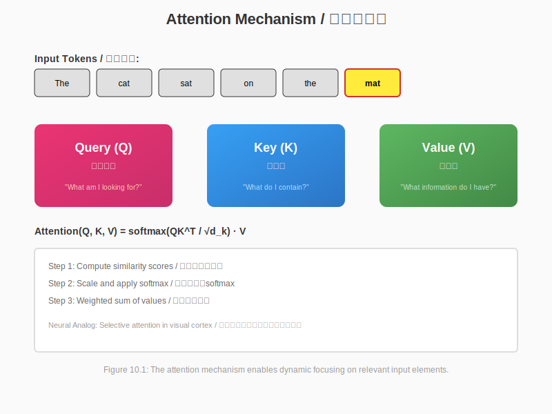

# Chapter 10: Attention and Control / 注意力与控制

## Chapter Objectives / 本章目标

By the end of this chapter, you will be able to:
- Understand attention mechanisms in neural networks and brains
- Explain the role of the prefrontal cortex in cognitive control
- Map Transformer attention to working memory processes
- Design attention-aware computing systems
- Analyze resource allocation in biological and artificial systems

在本章结束时，你将能够：
- 理解神经网络和大脑中的注意力机制
- 解释前额叶皮层在认知控制中的作用
- 将Transformer注意力映射到工作记忆过程
- 设计注意感知的计算系统
- 分析生物和人工系统中的资源分配

---

## 10.1 Attention Mechanisms / 注意力机制

### 10.1.1 Selective Attention in the Brain / 大脑中的选择性注意



*Figure 10.1: The attention mechanism enables dynamic focusing on relevant input elements, analogous to selective attention in the visual cortex.*

```
┌─────────────────────────────────────────────────────────────────────────────┐
│           ATTENTION SYSTEMS IN THE BRAIN / 大脑中的注意系统                 │
├─────────────────────────────────────────────────────────────────────────────┤
│                                                                             │
│  INPUT: Rich Sensory Environment / 输入：丰富的感觉环境                      │
│  ┌─────────────────────────────────────────────────────────────────────┐   │
│  │                                                                     │   │
│  │  Visual: 10⁶ optic nerve fibers / 视觉：10⁶视神经纤维               │   │
│  │  Auditory: 30,000 auditory nerve fibers / 听觉：30,000听神经纤维    │   │
│  │  Somatosensory: Touch, temperature, pain / 体感：触觉、温度、疼痛   │   │
│  │                                                                     │   │
│  │  TOTAL: ~10⁷ bits/second of raw sensory data!                      │   │
│  │  总计：~10⁷比特/秒的原始感觉数据！                                  │   │
│  │                                                                     │   │
│  └─────────────────────────────────────────────────────────────────────┘   │
│                                                                             │
│  PROBLEM: Limited processing capacity / 问题：有限的处理能力                │
│  ┌─────────────────────────────────────────────────────────────────────┐   │
│  │                                                                     │   │
│  │  Conscious awareness: ~40-60 bits/second                            │   │
│  │  意识觉知：~40-60比特/秒                                            │   │
│  │                                                                     │   │
│  │  Bottleneck: 10⁷ → 10² = 100,000× reduction!                        │   │
│  │  瓶颈：10⁷ → 10² = 100,000倍减少！                                  │   │
│  │                                                                     │   │
│  │  SOLUTION: Attention selects what reaches consciousness              │   │
│  │  解决方案：注意选择什么到达意识                                       │   │
│  │                                                                     │   │
│  └─────────────────────────────────────────────────────────────────────┘   │
│                                                                             │
│  ATTENTION MECHANISMS / 注意机制:                                           │
│  ┌─────────────────────────────────────────────────────────────────────┐   │
│  │                                                                     │   │
│  │  1. BOTTOM-UP (Stimulus-driven) / 自下而上（刺激驱动）                │   │
│  │     │                                                               │   │
│  │     ├──► Salience detection in Superior Colliculus / 上丘显著性检测  │   │
│  │     │   - Brightness, contrast, motion / 亮度、对比度、运动          │   │
│  │     │                                                               │   │
│  │     └──► Automatic orienting / 自动定向                              │   │
│  │         "Bottom-up attention captures you"                             │   │
│  │         "自下而上的注意捕获你"                                       │   │
│  │                                                                     │   │
│  │  2. TOP-DOWN (Goal-driven) / 自上而下（目标驱动）                     │   │
│  │     │                                                               │   │
│  │     ├──► Prefrontal Cortex sets goals / 前额叶皮层设定目标           │   │
│  │     │   - "Find the red object" / "找红色物体"                      │   │
│  │     │   - "Listen for your name" / "听你的名字"                     │   │
│  │     │                                                               │   │
│  │     └──► Biases sensory processing / 偏向感觉处理                    │   │
│  │         "Top-down attention is voluntary control"                      │   │
│  │         "自上而下的注意是自愿控制"                                   │   │
│  │                                                                     │   │
│  └─────────────────────────────────────────────────────────────────────┘   │
│                                                                             │
│  NEURAL CIRCUITRY / 神经环路:                                               │
│                                                                             │
│         PFC (Prefrontal Cortex) / 前额叶皮层                                │
│              │                                                              │
│              │ Goal signals / 目标信号                                       │
│              ▼                                                              │
│         Parietal Cortex (Priority map) / 顶叶皮层（优先级地图）             │
│              │                                                              │
│              │ Attentional weights / 注意权重                                │
│              ▼                                                              │
│         Thalamus (Sensory gateway) / 丘脑（感觉门户）                       │
│              │                                                              │
│              │ Gating / 门控                                                 │
│              ▼                                                              │
│         Visual Cortex / 视觉皮层                                            │
│              │                                                              │
│              └─► Enhanced processing of attended stimuli / 增强处理被注意刺激│
│                                                                             │
└─────────────────────────────────────────────────────────────────────────────┘
```

### 10.1.2 Transformer Self-Attention / Transformer自注意

```
┌─────────────────────────────────────────────────────────────────────────────┐
│           SELF-ATTENTION MECHANISM / 自注意机制                             │
├─────────────────────────────────────────────────────────────────────────────┤
│                                                                             │
│  MOTIVATION / 动机:                                                         │
│                                                                             │
│  RNNs process sequentially: Slow for long sequences                         │
│  RNN顺序处理：长序列慢                                                      │
│                                                                             │
│  CNNs have limited receptive field: Miss long-range dependencies            │
│  CNN感受野有限：错过长距离依赖                                              │
│                                                                             │
│  SOLUTION: Self-attention allows direct connections between any positions   │
│  解决方案：自注意允许任何位置之间的直接连接                                 │
│                                                                             │
│  MECHANISM / 机制:                                                          │
│                                                                             │
│  Input: X = [x₁, x₂, ..., xₙ]  (sequence of vectors / 向量序列)             │
│                                                                             │
│  For each position i / 对每个位置i:                                         │
│                                                                             │
│  ┌─────────────────────────────────────────────────────────────────────┐   │
│  │                                                                     │   │
│  │  Step 1: Create Query, Key, Value / 创建Query、Key、Value           │   │
│  │                                                                     │   │
│  │  Qᵢ = W_Q × xᵢ    (What am I looking for? / 我在寻找什么？)         │   │
│  │  Kⱼ = W_K × xⱼ    (What do I contain? / 我包含什么？)               │   │
│  │  Vⱼ = W_V × xⱼ    (What information do I have? / 我有什么信息？)    │   │
│  │                                                                     │   │
│  │  Step 2: Compute Attention Scores / 计算注意分数                    │   │
│  │                                                                     │   │
│  │  score(i,j) = Qᵢᵀ × Kⱼ / √d                                         │   │
│  │                                                                     │   │
│  │  Step 3: Normalize with Softmax / 用Softmax归一化                   │   │
│  │                                                                     │   │
│  │  αᵢⱼ = exp(score(i,j)) / Σₖ exp(score(i,k))                         │   │
│  │                                                                     │   │
│  │  Step 4: Weighted Sum of Values / 值的加权和                        │   │
│  │                                                                     │   │
│  │  outputᵢ = Σⱼ αᵢⱼ × Vⱼ                                              │   │
│  │                                                                     │   │
│  └─────────────────────────────────────────────────────────────────────┘   │
│                                                                             │
│  VISUAL EXAMPLE / 可视化示例:                                               │
│                                                                             │
│  Sentence: "The cat sat on the mat" / 句子                                  │
│                                                                             │
│  Attention from "sat" / 从"sat"出发的注意:                                  │
│                                                                             │
│  The    cat    sat    on    the    mat                                     │
│   │      │      │      │      │      │                                      │
│  0.1   0.3    ──►   0.2   0.2   0.2   (attention weights / 注意权重)       │
│         ▲                                                                   │
│         └── "cat" is most relevant to "sat" / "cat"与"sat"最相关           │
│                                                                             │
│  NEURAL ANALOGY / 神经类比:                                                 │
│                                                                             │
│  • Query ↔ Current focus of attention / 当前注意焦点                        │
│  • Key ↔ Salience of items in working memory / 工作记忆中项目的显著性       │
│  • Value ↔ Content of representation / 表征的内容                           │
│  • Softmax ↔ Competitive inhibition / 竞争抑制                              │
│                                                                             │
└─────────────────────────────────────────────────────────────────────────────┘
```

---

## 10.2 Cognitive Control and the Prefrontal Cortex / 认知控制与前额叶皮层

### 10.2.1 Executive Functions / 执行功能

```
┌─────────────────────────────────────────────────────────────────────────────┐
│           PREFRONTAL CORTEX FUNCTIONS / 前额叶皮层功能                      │
├─────────────────────────────────────────────────────────────────────────────┤
│                                                                             │
│  ┌─────────────────────────────────────────────────────────────────────┐   │
│  │                                                                     │   │
│  │  WORKING MEMORY / 工作记忆                                          │   │
│  │  │                                                                  │   │
│  │  ├──► Maintenance of information over seconds                      │   │
│  │  │    几秒钟内的信息维持                                            │   │
│  │  │                                                                  │   │
│  │  ├──► Capacity: 7±2 items (Miller, 1956)                           │   │
│  │  │    容量：7±2项 (Miller, 1956)                                   │   │
│  │  │                                                                  │   │
│  │  └──► Persistent neural activity / 持续的神经活动                   │   │
│  │                                                                  │   │
│  ├─────────────────────────────────────────────────────────────────────┤   │
│  │                                                                     │   │
│  │  INHIBITORY CONTROL / 抑制控制                                      │   │
│  │  │                                                                  │   │
│  │  ├──► Suppressing prepotent responses                              │   │
│  │  │    抑制优势反应                                                  │   │
│  │  │                                                                  │   │
│  │  ├──► Stroop task: "Say color, not word"                           │   │
│  │  │    Stroop任务："说颜色，不是字"                                 │   │
│  │  │                                                                  │   │
│  │  └──► Resisting temptations / 抵制诱惑                             │   │
│  │                                                                  │   │
│  ├─────────────────────────────────────────────────────────────────────┤   │
│  │                                                                     │   │
│  │  COGNITIVE FLEXIBILITY / 认知灵活性                                 │   │
│  │  │                                                                  │   │
│  │  ├──► Task switching / 任务切换                                     │   │
│  │  │                                                                  │   │
│  │  ├──► Rule learning / 规则学习                                      │   │
│  │  │                                                                  │   │
│  │  └──► Adapting to new situations / 适应新情况                      │   │
│  │                                                                  │   │
│  ├─────────────────────────────────────────────────────────────────────┤   │
│  │                                                                     │   │
│  │  PLANNING AND DECISION MAKING / 规划和决策                          │   │
│  │  │                                                                  │   │
│  │  ├──► Future-oriented behavior / 面向未来的行为                     │   │
│  │  │                                                                  │   │
│  │  ├──► Evaluating options / 评估选项                                 │   │
│  │  │                                                                  │   │
│  │  └──► Delayed gratification / 延迟满足                             │   │
│  │                                                                  │   │
│  └─────────────────────────────────────────────────────────────────────┘   │
│                                                                             │
│  COMPUTATIONAL ANALOGY / 计算类比:                                          │
│                                                                             │
│  PFC ↔ Operating System / 前额叶皮层 ↔ 操作系统                             │
│                                                                             │
│  • Task scheduling ↔ Process scheduling / 任务调度 ↔ 进程调度              │
│  • Resource allocation ↔ Memory management / 资源分配 ↔ 内存管理            │
│  • Priority setting ↔ Process priority / 优先级设定 ↔ 进程优先级           │
│  • Interrupt handling ↔ Signal handling / 中断处理 ↔ 信号处理              │
│                                                                             │
└─────────────────────────────────────────────────────────────────────────────┘
```

---

## Chapter Summary / 本章总结

**Key Points / 要点**:

1. **Attention** selects relevant information from overwhelming sensory input.
   **注意**从压倒性的感觉输入中选择相关信息。

2. **Bottom-up** attention is stimulus-driven; **top-down** attention is goal-directed.
   **自下而上**注意是刺激驱动的；**自上而下**注意是目标导向的。

3. **Transformer self-attention** implements a parallel, content-addressable lookup mechanism.
   **Transformer自注意**实现并行、内容寻址的查找机制。

4. **Prefrontal cortex** provides executive control, analogous to an operating system.
   **前额叶皮层**提供执行控制，类似于操作系统。

**Comparison Table / 比较表**:

| Brain System / 脑系统 | AI Equivalent / AI等价物 | Function / 功能 |
|---------------------|-------------------------|----------------|
| Thalamus / 丘脑 | Input gating / 输入门控 | Sensory selection / 感觉选择 |
| Parietal cortex / 顶叶皮层 | Priority map / 优先级地图 | Attention allocation / 注意分配 |
| PFC / 前额叶皮层 | Controller / 控制器 | Goal management / 目标管理 |
| Working memory / 工作记忆 | Attention mechanism / 注意机制 | Information maintenance / 信息维持 |

---

*Next Chapter: Chapter 11 - Multimodal Integration / 下一章：第11章 - 多模态整合*
